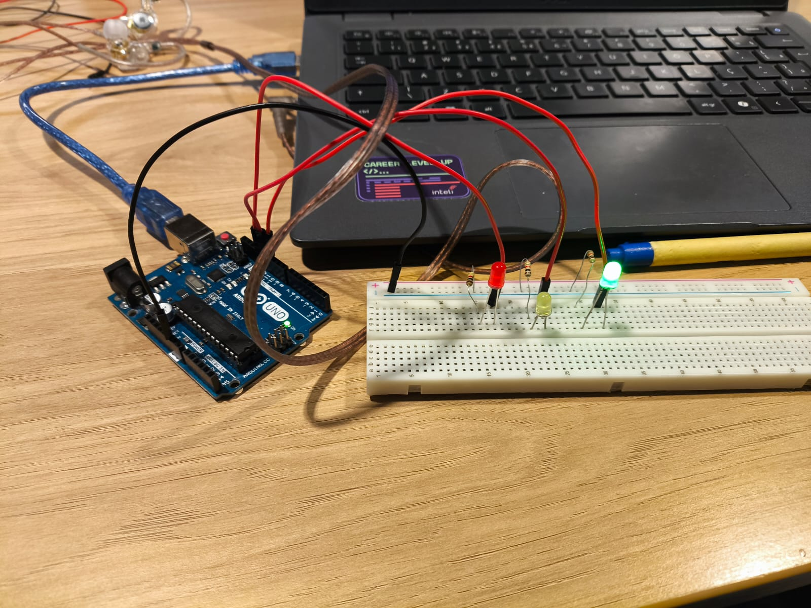
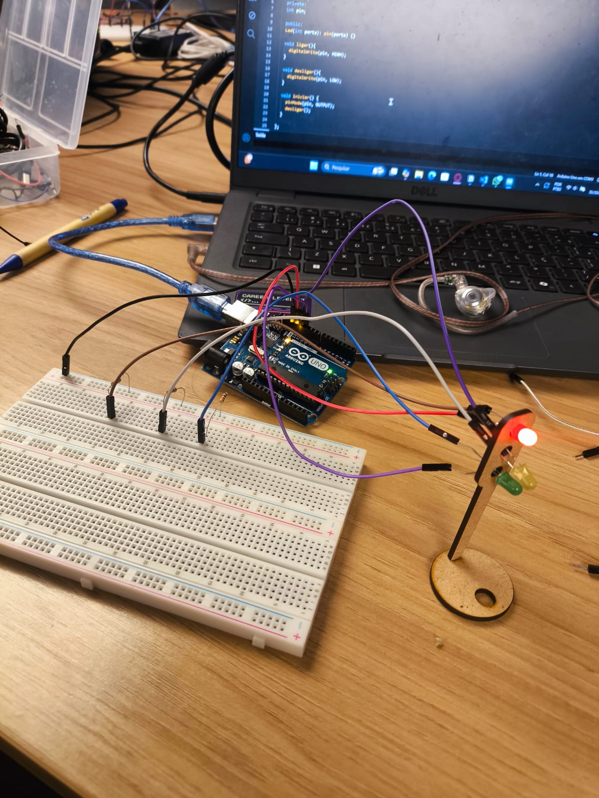

# Projeto Semáforo com LEDs e Arduino

## 1. Visão Geral do Projeto (Partes 1 e 2)

O objetivo central deste projeto é simular o funcionamento básico de um semáforo de trânsito em escala reduzida, utilizando Diodos Emissores de Luz (LEDs) nas cores padrão (Vermelho, Amarelo e Verde) e uma placa microcontroladora Arduino.

O projeto é dividido em **duas etapas principais** de documentação e execução:

* **Parte 1 (Hardware Básico - Esta Seção):** Foco na montagem fundamental do circuito eletrônico utilizando a protoboard e na implementação da lógica de temporização (software).
* **Parte 2 (Montagem Aprimorada):** Foco na estética e realismo, migrando a montagem para uma base física de semáforo e adaptando os componentes e a conexão (cabos Macho-Fêmea).

A lógica de programação (Software) é mantida em ambas as partes, demonstrando a versatilidade do código em diferentes configurações de hardware.

## 2. Componentes e Montagem (Hardware)

### 2.1. Lista de Materiais

| Componente | Quantidade | Função |
| :--- | :---: | :--- |
| Placa Microcontroladora (Arduino UNO ou similar) | 1 | Controla a lógica e temporização. |
| LED Vermelho | 1 | Sinalização de Parada. |
| LED Amarelo | 1 | Sinalização de Atenção / Transição. |
| LED Verde | 1 | Sinalização de Livre. |
| Resistor de $1k\Omega$ | 3 | Limita a corrente e protege cada LED. |
| Protoboard | 1 | Base para montagem do circuito sem solda. |
| Fios Jumper | 4 | Conexões elétricas. |

### 2.2. Detalhes da Resistência (Cálculo e Seleção)

A escolha do resistor é crucial para limitar a corrente e proteger os LEDs, que serão conectados à saída de $5V$ dos pinos digitais do Arduino.

**Dados Considerados:**
* Tensão da Fonte ($V_{fonte}$): $5V$
* Corrente de Operação Desejada ($I$): **$5mA$ ou $0.005A$**
* Tensão Direta Assumida do LED ($V_{LED}$):
    * LEDs Vermelho e Amarelo: $V_{LED} = 2.0V$
    * LED Azul (Cálculo Teórico): $V_{LED} = 3.0V$

**Fórmulas Utilizadas:**

1.  **Tensão no Resistor ($V_{resistor}$):**
    $$V_{resistor} = V_{fonte} - V_{LED}$$
2.  **Resistência Mínima Necessária ($R$ - Lei de Ohm):**
    $$R = \frac{V_{resistor}}{I}$$

**Cálculos de Resistência Mínima ($R_{mín}$):**

| LED | $V_{LED}$ | $V_{resistor}$ ($5V - V_{LED}$) | $R_{mín}$ ($V_{resistor} / 0.005A$) |
| :--- | :---: | :---: | :---: |
| Vermelho/Amarelo | $2.0V$ | $5V - 2V = 3V$ | $R_{mín} = \frac{3V}{0.005A} = 600\Omega$ |
| Azul (Teórico) | $3.0V$ | $5V - 3V = 2V$ | $R_{mín} = \frac{2V}{0.005A} = 400\Omega$ |

**Resistor Selecionado:**
Foi escolhido um resistor comercial de **$1k\Omega$ ($1000\Omega$)** para todos os LEDs. Este valor é superior a ambos os mínimos calculados ($600\Omega$ e $400\Omega$). Utilizar uma resistência maior resulta em uma corrente elétrica menor que $5mA$, o que garante maior segurança, longevidade e proteção dos LEDs.

### 2.3. Esquema de Conexão (Wiring)

Cada LED (ânodo/pino longo) é conectado a um pino digital do Arduino através de um resistor. O cátodo (pino curto) de todos os LEDs é conectado ao pino de terra (`GND`) da Protoboard/Arduino.

| LED | Pino Digital do Arduino | Componente de Proteção |
| :--- | :---: | :--- |
| **Vermelho** | **13** | Resistor $1k\Omega$ |
| **Amarelo** | **12** | Resistor $1k\Omega$ |
| **Verde** | **11** | Resistor $1k\Omega$ |

## 3. Lógica e Programação (Software)

### 3.1. Lógica do Ciclo

O código implementa o ciclo de um semáforo convencional:

1.  **Vermelho** (Parar): **6 segundos**
2.  **Verde** (Livre): **4 segundos**
3.  **Amarelo** (Atenção/Transição): **2 segundos**
4.  O ciclo se repete: Amarelo $\rightarrow$ Vermelho.

### 3.2. Código Arduino (Sketch)

```cpp
// Função de configuração inicial, executada uma única vez ao iniciar o Arduino
void setup() {
  pinMode(13, OUTPUT); // Define o pino 13 como saída (geralmente usado para LED vermelho)
  pinMode(12, OUTPUT); // Define o pino 12 como saída (pode ser LED amarelo)
  pinMode(11, OUTPUT); // Define o pino 11 como saída (pode ser LED verde)
}

// Função principal que roda continuamente em loop
void loop() {
  digitalWrite(13, HIGH); // Liga o LED conectado ao pino 13
  delay(6000);            // Aguarda 6 segundos
  digitalWrite(13, LOW);  // Desliga o LED do pino 13

  digitalWrite(12, HIGH); // Liga o LED conectado ao pino 12
  delay(2000);            // Aguarda 2 segundos
  digitalWrite(12, LOW);  // Desliga o LED do pino 12

  digitalWrite(11, HIGH); // Liga o LED conectado ao pino 11
  delay(2000);            // Aguarda 2 segundos
  digitalWrite(11, LOW);  // Desliga o LED do pino 11
}
```

## 4. Mídia do Projeto

### 4.1. Circuito Físico

Abaixo estão as imagens da montagem final do semáforo na protoboard, conectado ao Arduino.

<div>
  
</div>


### 4.2. Demonstração em Vídeo

O vídeo a seguir demonstra o funcionamento do ciclo do semáforo, seguindo a lógica de temporização programada (6s Vermelho, 4s Verde, 2s Amarelo).


[Link para o Vídeo de Demonstração](https://drive.google.com/drive/folders/150NuMTijh4dPkZKFB9HDuYB8PkS-lBro?usp=sharing)

# Projeto Semáforo com LEDs e Base (Parte 2: Montagem Aprimorada)

## 1. Visão Geral (Parte 2)

Esta seção documenta a **segunda fase** do projeto Semáforo com Arduino. O foco aqui é aprimorar a montagem do circuito com a inclusão de uma **base física que simula a estrutura real do semáforo** (eliminando a Protoboard) e adaptando a lista de materiais para a nova forma de conexão, utilizando predominantemente **fios jumper macho-fêmea** para interface direta com a base.

A lógica de programação do ciclo de temporização permanece inalterada em relação à Parte 1.

## 2. Componentes e Montagem (Hardware)

### 2.1. Lista de Materiais Aprimorada

Esta lista reflete as mudanças para a montagem em uma base ou estrutura de semáforo, minimizando o uso da protoboard.

| Componente | Quantidade | Função | Diferença em Relação à Parte 1 |
| :--- | :---: | :--- | :--- |
| Placa Microcontroladora (Arduino UNO ou similar) | 1 | Controla a lógica e temporização. | Sem alteração. |
| **Resistor de $1k\Omega$ (5% de tolerância)** | 3 | Limita a corrente e protege cada LED. | Especificação de tolerância adicionada. |
| LED Vermelho | 1 | Sinalização de Parada. | Sem alteração. |
| LED Amarelo | 1 | Sinalização de Atenção / Transição. | Sem alteração. |
| LED Verde | 1 | Sinalização de Livre. | Sem alteração. |
| **Fio Jumper Macho-Fêmea** | 6 | Conexão dos LEDs (Ânodo e Cátodo) aos pinos do Arduino. | Permite conexão direta com a base/LEDs. |
| **Fio Jumper Macho-Macho** | 1 | Conexão do Terra (`GND`) da Protoboard ao Arduino (opcionalmente) ou em outras conexões. | Cabo para conexões gerais. |
| **Base/Estrutura do Semáforo** | 1 | Suporte físico para os LEDs (Simulação visual). | **Nova adição.** |

### 2.2. Detalhes da Resistência (Revalidação)

A seleção do resistor de $\mathbf{1k\Omega}$ ($1000\Omega$) é **mantida** e **revalidada**.

* O resistor de $1k\Omega$ é **seguro** e suficiente para acender os LEDs com correntes entre **$2mA$ e $3mA$** (dependendo da cor do LED), protegendo os LEDs e prolongando sua vida útil.
* A tolerância de **5%** é o padrão para resistores comerciais e não afeta significativamente o funcionamento do circuito para este projeto.

### 2.3. Esquema de Conexão (Wiring)

Nesta montagem, os fios **jumper Macho-Fêmea** são cruciais para a conexão direta com a base do semáforo.

| LED | Pino Digital do Arduino | Componente de Proteção | Tipo de Jumper |
| :--- | :---: | :--- | :--- |
| **Vermelho** | **13** | Resistor $1k\Omega$ | Macho-Fêmea (Recomendado) |
| **Amarelo** | **12** | Resistor $1k\Omega$ | Macho-Fêmea (Recomendado) |
| **Verde** | **11** | Resistor $1k\Omega$ | Macho-Fêmea (Recomendado) |
| **Terra (GND Comum)** | **GND** | N/A | Macho-Fêmea (Para conectar ao cátodo comum) |

> **Detalhe da Conexão:** O resistor de $1k\Omega$ deve ser ligado em série com o pino de controle de cada LED (ânodo/pino longo) antes de conectar ao respectivo pino digital (13, 12, 11) do Arduino. O cátodo (pino curto) de todos os LEDs é conectado em comum ao pino de `GND` do Arduino.

## 3. Lógica e Programação (Software)

### 3.1. Lógica do Ciclo

A lógica do ciclo é a mesma da Parte 1:

1.  **Vermelho** (Parar): **6 segundos**
2.  **Verde** (Livre): **4 segundos**
3.  **Amarelo** (Atenção/Transição): **2 segundos**
4.  O ciclo se repete: Amarelo $\rightarrow$ Vermelho.

### 3.2. Código Arduino (Sketch)

O código se mantém inalterado, utilizando as classes `Led` e `Semaforo` para organização.

```cpp
int tempos[3] = {6000, 2000, 4000};
int* ponteiro = tempos;


class Led {
  private:
  int pin;

  public:
  Led(int porta): pin(porta) {}

  void ligar(){
    digitalWrite(pin, HIGH);
  }

  void desligar(){
    digitalWrite(pin, LOW);
  }

  void iniciar() {
    pinMode(pin, OUTPUT);
    desligar();
  }

};

class Semaforo {
  private:
  Led vermelho;
  Led amarelo;
  Led verde;

  public:
  Semaforo(int portaVermelha, int portaAmarela, int portaVerde): vermelho(portaVermelha), amarelo(portaAmarela), verde(portaVerde) {}

  void iniciar() {
    vermelho.iniciar();
    amarelo.iniciar();
    verde.iniciar();
  }
  
  void comecar() {
    vermelho.ligar();
    delay(*ponteiro);
    vermelho.desligar();

    amarelo.ligar();
    delay(*(ponteiro + 1));
    amarelo.desligar();

    verde.ligar();
    delay(*(ponteiro + 2));
    verde.desligar();
  }
};
Semaforo butatan(13, 12, 11);

void setup() {
  butatan.iniciar();

}

void loop() {
  butatan.comecar();
}
```

# Projeto Semáforo com LEDs e Base (Parte 2: Montagem Aprimorada)

## 1. Visão Geral (Parte 2)

Esta seção documenta a **segunda fase** do projeto Semáforo com Arduino. O foco aqui é aprimorar a montagem do circuito com a inclusão de uma **base física que simula a estrutura real do semáforo** (eliminando a Protoboard) e adaptando a lista de materiais para a nova forma de conexão, utilizando predominantemente **fios jumper macho-fêmea** para interface direta com a base.

A lógica de programação do ciclo de temporização permanece inalterada em relação à Parte 1.

## 2. Componentes e Montagem (Hardware)

### 2.1. Lista de Materiais Aprimorada

Esta lista reflete as mudanças para a montagem em uma base ou estrutura de semáforo, minimizando o uso da protoboard.

| Componente | Quantidade | Função | Diferença em Relação à Parte 1 |
| :--- | :---: | :--- | :--- |
| Placa Microcontroladora (Arduino UNO ou similar) | 1 | Controla a lógica e temporização. | Sem alteração. |
| **Resistor de $1k\Omega$ (5% de tolerância)** | 3 | Limita a corrente e protege cada LED. | Especificação de tolerância adicionada. |
| LED Vermelho | 1 | Sinalização de Parada. | Sem alteração. |
| LED Amarelo | 1 | Sinalização de Atenção / Transição. | Sem alteração. |
| LED Verde | 1 | Sinalização de Livre. | Sem alteração. |
| **Fio Jumper Macho-Fêmea** | 6 | Conexão dos LEDs (Ânodo e Cátodo) aos pinos do Arduino. | Permite conexão direta com a base/LEDs. |
| **Fio Jumper Macho-Macho** | 1 | Conexão do Terra (`GND`) da Protoboard ao Arduino (opcionalmente) ou em outras conexões. | Cabo para conexões gerais. |
| **Base/Estrutura do Semáforo** | 1 | Suporte físico para os LEDs (Simulação visual). | **Nova adição.** |

### 2.2. Detalhes da Resistência (Revalidação)

A seleção do resistor de $\mathbf{1k\Omega}$ ($1000\Omega$) é **mantida** e **revalidada**.

* O resistor de $1k\Omega$ é **seguro** e suficiente para acender os LEDs com correntes entre **$2mA$ e $3mA$** (dependendo da cor do LED), protegendo os LEDs e prolongando sua vida útil.
* A tolerância de **5%** é o padrão para resistores comerciais e não afeta significativamente o funcionamento do circuito para este projeto.

### 2.3. Esquema de Conexão (Wiring)

Nesta montagem, os fios **jumper Macho-Fêmea** são cruciais para a conexão direta com a base do semáforo.

| LED | Pino Digital do Arduino | Componente de Proteção | Tipo de Jumper |
| :--- | :---: | :--- | :--- |
| **Vermelho** | **13** | Resistor $1k\Omega$ | Macho-Fêmea (Recomendado) |
| **Amarelo** | **12** | Resistor $1k\Omega$ | Macho-Fêmea (Recomendado) |
| **Verde** | **11** | Resistor $1k\Omega$ | Macho-Fêmea (Recomendado) |
| **Terra (GND Comum)** | **GND** | N/A | Macho-Fêmea (Para conectar ao cátodo comum) |

> **Detalhe da Conexão:** O resistor de $1k\Omega$ deve ser ligado em série com o pino de controle de cada LED (ânodo/pino longo) antes de conectar ao respectivo pino digital (13, 12, 11) do Arduino. O cátodo (pino curto) de todos os LEDs é conectado em comum ao pino de `GND` do Arduino.

## 3. Lógica e Programação (Software)

### 3.1. Lógica do Ciclo

A lógica do ciclo é a mesma da Parte 1:

1.  **Vermelho** (Parar): **6 segundos**
2.  **Verde** (Livre): **4 segundos**
3.  **Amarelo** (Atenção/Transição): **2 segundos**
4.  O ciclo se repete: Amarelo $\rightarrow$ Vermelho.

### 3.2. Código Arduino (Sketch)

O código se mantém inalterado, utilizando as classes `Led` e `Semaforo` para organização.

```cpp
int tempos[3] = {6000, 2000, 4000};
int* ponteiro = tempos;


class Led {
  private:
  int pin;

  public:
  Led(int porta): pin(porta) {}

  void ligar(){
    digitalWrite(pin, HIGH);
  }

  void desligar(){
    digitalWrite(pin, LOW);
  }

  void iniciar() {
    pinMode(pin, OUTPUT);
    desligar();
  }

};

class Semaforo {
  private:
  Led vermelho;
  Led amarelo;
  Led verde;

  public:
  Semaforo(int portaVermelha, int portaAmarela, int portaVerde): vermelho(portaVermelha), amarelo(portaAmarela), verde(portaVerde) {}

  void iniciar() {
    vermelho.iniciar();
    amarelo.iniciar();
    verde.iniciar();
  }
  
  void comecar() {
    vermelho.ligar();
    delay(*ponteiro);
    vermelho.desligar();

    amarelo.ligar();
    delay(*(ponteiro + 1));
    amarelo.desligar();

    verde.ligar();
    delay(*(ponteiro + 2));
    verde.desligar();
  }
};
Semaforo butatan(13, 12, 11);

void setup() {
  butatan.iniciar();

}

void loop() {
  butatan.comecar();
}
```
### 4. Mídia do Projeto

## 4.1. Circuito Físico e Base
Abaixo está a imagem da montagem final, destacando a nova base de simulação do semáforo e o uso dos cabos Macho-Fêmea.

<div>
  
</div>

### 4.2. Demonstração em Vídeo 
O vídeo a seguir demonstra o funcionamento do ciclo do semáforo na nova base, seguindo a lógica de temporização programada (6s Vermelho, 4s Verde, 2s Amarelo).

[Link para o Vídeo de Demonstração com a base](https://drive.google.com/drive/folders/1FtbpSNweFd03tTDt5rQZAY-QAOpYRjXp?usp=sharing)
